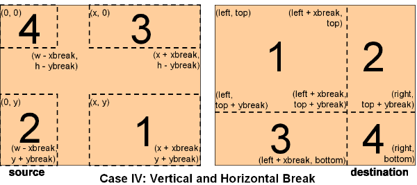
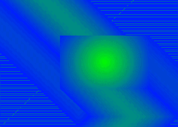
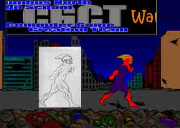
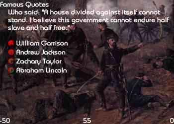
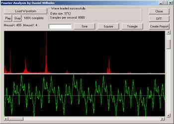
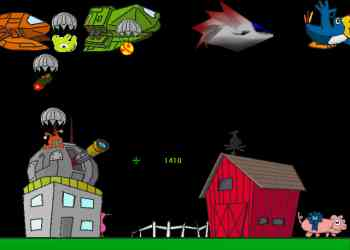
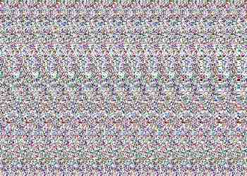
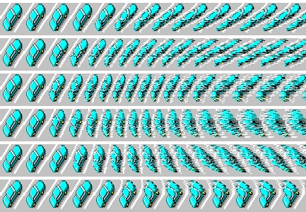
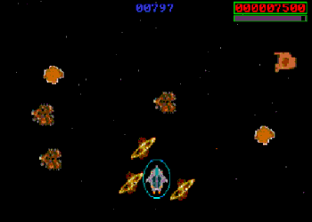
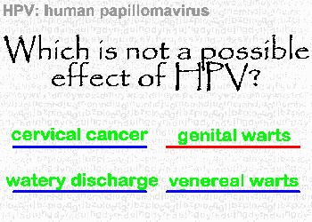

# Dan Wilhelm's High School Coding Portfolio

This (unmodified) portfolio was originally delivered via CD-ROM, written between ~1995-2002. The included code was written on my family's 486/33MHz PC, without home Internet until the final year. Despite seeming comprehensive, it excludes many school projects and innumerable QBASIC programs written prior to learning C/C++.

---

## ReadMe.doc

This CD contains my entire collection of completed programming endeavors, including graphics libraries, games, applications, and articles. All of the source code on this CD is original, and the very few exceptions are documented. This CD represents thousands of hours of coding and study over seven years, and the programs show this, totalling 16,716 lines of original source.

Executables are included for all applications, libraries, and presentations in the /bin directory of each program. For ease of access, note that the Shortcuts folder on this CD allows you to execute all of the programs from one convenient location. Your CD-ROM drive must be the D:/ drive for this feature to work. Note that some of the programs require DirectX 8 to be installed. Also, some of the programs were compiled using the Introductory Version of Visual C++ 6.0, so a box will pop up before the program executes. Press OK to begin the program. All of the programming libraries include sample programs that showcase some, but not all, of the capabilities of the libraries. They are short demos that I used to test a few features and do not represent the entire library.

It is recommended that you visit the Shortcuts directory first. To browse the source code, look through the directories on the CD. Most sources contain project and workspace files (.dsp and .dsw files) that can be opened and compiled in Microsoft Visual C++ 6.0. Some code requires the installation of 3rd-party libraries such as the DirectX 8 SDK to compile correctly. A full listing and explanation of my software is included in this document, as well as instructions for running the included executables. Have fun!

Daniel Wilhelm

 

---

## Articles

### Advanced Image Panning - [Source](<Articles/Advanced Image Panning>) | [GameDev.net](https://www.gamedev.net/tutorials/programming/graphics/advanced-image-panning-r1311/)

- This article was submitted to and published by GameDev.net, a popular website for amateur game programmers. It discusses a new algorithm I researched and implemented in my XMedia Programmer’s Library below for panning images with wrap-around. Included is the article, full source code, and graphics depicting the algorithm’s workings.

## Completed Programming Libraries

### DirectX 8 2D Library (Visual C++ 6.0) - [Source](<Completed Programming Libraries/DirectX 8 2D Library>)
- A complete graphics library based on my XMedia library below that draws 2D graphics in a 3D DirectX window. It utilizes the D3DX library that Microsoft provides with the DirectX 8 SDK to draw textured quads for 2D sprites.
- [EXE] Just a small demo of its drawing capabilities in a windowed mode. Click the left mouse button to see another 2D sprite. The right mouse button exits. REQUIRES DIRECTX 8 OR LATER.

### VESA banked library (DJGPP and NASM) - [Source](<Completed Programming Libraries/VESA banked library>)

- A complete graphics library coded in assembler and C that uses the VESA standard for displaying graphics. It supports banked video modes.
- [EXE] A demo of its capabilities. Press the space bar after the initial fill/line demo, then press Enter to exit the program when the loaded sprite bounces around the screen.

### XMedia Programmer’s Library (Visual C++ 6.0) - [Source](<Completed Programming Libraries/XMedia Programmer's Library>)

- A library that encapsulates many of the functions of DirectX 7, including Graphics, Input, Sound, and Music. The library was intended to make DirectX simpler to learn and program in.
- [EXE] The first sample, CGCT, is a short demo I created to advertise for one of my clubs, the Computer Game Creation Team. Press Escape to exit. The second sample is a simple starfield. Press the arrow keys to navigate and the Escape key to exit. REQUIRES DIRECTX 7 OR LATER.

## Completed Programs

### Civil War Trivia (Visual C++ 6.0 – Windows SDK) - [Source](<Completed Programs/Civil War Trivia>)

- This is a quiz game made for AP US History. It uses my XMedia Programmer’s Library for graphics, windows wrappers, and input.
- [EXE] Player one presses A, S, D, and F for the choices A, B, C, and D (respectively). Player two presses 4, 5, 6, and Enter (on the numeric keypad) for the respective choices A, B, C, and D. Escape exits the program after a short delay. REQUIRES DIRECTX 7 OR LATER.

### Fourier Analysis (Visual C++ 6.0 – Windows SDK) - [Source](<Completed Programs/Fourier Analysis>)

- This is a graphical Windows application that performs a Fourier Analysis on a sound wave.
- NOTE: Must be installed to hard disk to play sounds (not required). Either input a frequency in the input box and press Sine, Square or Triangle to create a periodic waveform, or press Load Waveform to load a wave file (samples provided). Next, press DFT to graph a Discrete Fourier Transform of the dataset. Press Create Report afterward to generate a list of the DFT and function data points. You can zoom in/out on the graphs by using the vertical scroll bar. You can pan along them (after zooming in) using the horizontal bar.

### MFC Brief Formatter (Visual C++ 6.0 – MFC) - [Source](<Completed Programs/MFC Brief Formatter>)
- This program was developed to port briefs – small news stories – to the school website. It formats multiple briefs to a single HTML file.
- [EXE] Type a Headline, Byline, and Story. Now choose an HTML file to save it to and press Add. Press Exit to leave the program.

### Paraliens (Visual C++ 6.0 – Windows SDK) - [Source](<Completed Programs/Paraliens>)

- This game’s media was created by a school club, the Computer Game Creation Team. It uses my XMedia Programmer’s Library mentioned above. Parashooting aliens drop from the sky and you attempt to hold them off.
- [EXE] Press the arrow keys or move the mouse to aim the crosshair. Press the space bar or left mouse button to fire at the aliens. Note that the ships are vulnerable to attack, so for a more enjoyable experience, wait until they drop parashooting aliens before firing. When your weapons are upgraded, you can press the keys 1-7 to switch weapons. Press Escape to exit. REQUIRES DIRECTX 7 OR LATER.

### Razor DX 8 Example (Visual C++ 6.0 – Windows SDK) - [Source](<Completed Programs/Razor DX 8 Example>)
- This is a simple program that blits shaded triangles to the screen for a requested video mode and rendering style. It was an Internet collaboration project between me and Dayle Flowers.
- [EXE] Select the desired video mode by scrolling the horizontal scroll bar left and right. Select Windowed or Fullscreen mode. Select HAL (hardware rendering) or REF (software rendering). Note that REF is substantially slower if your computer does not contain a 3D accelerator. Press Run to begin. The Escape key exits. REQUIRES DIRECTX 8 OR LATER.

### SIRDS Generator (DJGPP) - [Source](<Completed Programs/SIRDS Generator>)
 

- This program creates Magic Eye (SIRDS) images from a given image. An image can also be used as the foreground image. Note that the hidden image’s colors must be set up in a special way to see a correctly calculated stereogram. 
- [EXE] It is recommended that you run (double-click on) one of the two pre-made batch files. This program is command-line driven; if you wish to run it from the command line, run the .EXE without parameters for more details.

### Space Rocks (Visual C++ 1.0) - [Source](<Completed Programs/Space Rocks>)

- This is the Computer Game Creation Team’s first game. The CGCT created the media for it. This program is special because it uses a media compression/packing algorithm and file format that I developed. All graphics functions in this program were coded in 16-bit inline assembly language for mode 13h. In the game, you must safely navigate your spaceship through asteroid fields.
- [EXE] Press New Game to start a new level or High Scores to view the high scores. Use the mouse to control your ship, press the left mouse button to shoot, and hold down the right mouse button to activate your shields (limited). Press Escape to exit. Note that you must be in the main playing screen to exit.

## DanOS Presentation System

This presentation system uses the VESA graphics libraries mentioned above. I had originally intended the assembler version to be the graphics core for an OS project, but because other interests distracted me, my plans never came to fruition. Thus, hoping to salvage some use from the graphics system, I turned it into a presentation system for school.

### Carl Jung Presentation (DJGPP) - [Source](<DanOS Presentation System/Carl Jung Presentation>)
- This uses a fade technique and executes shell commands.
- [EXE] Press the space bar to advance slides. Press Escape or Enter to exit the plasma. WARNING: It is recommended that you run this program in MS-DOS mode.

### HPV and Rheu Presentation (DJGPP) - [Source](<DanOS Presentation System/HPV and Rheu Presentation>)

- This uses animated slides and executes shell commands.
- [EXE] Press the space bar to advance slides. WARNING: It is recommended that you run this program in MS-DOS mode.

## Other

### USACO Programming (DJGPP / Visual C++ 6.0) - [Source](<Other/USACO Programming>)
- The USACO (USA Computing Olympiad) is an algorithm-oriented programming contest sponsored by the University of Wisconsin. Given about forty minutes per problem description, you must design and code the solution to an algorithmic problem. I independently entered this contest on my own initiative, and have placed well for no formal computer programming training. Included are many of the program solutions I have written. Note that they were coded with a time limit.
